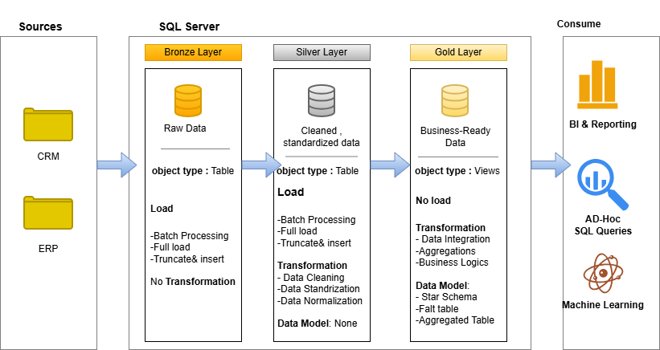

# 🏢 CRM & ERP Data Warehouse — End-to-End SQL Project

A complete **Data Warehouse** built from scratch using **Medallion Architecture** (Bronze → Silver → Gold), integrating data from two source systems — a **CRM System** and an **ERP System** — into a clean **Star Schema** optimized for BI reporting and analytics.

---

## 📐 Data Architecture

The project follows the **Medallion Architecture** consisting of three layers:

| Layer | Description | Object Type | Load Strategy |
|-------|-------------|-------------|---------------|
| **Bronze (Raw)** | Stores data exactly as it comes from the source systems | Table | Batch Processing / Full Load / Truncate & Insert |
| **Silver (Cleansed)** | Data is cleaned, deduplicated, and normalized | Table | Batch Processing / Full Load / Truncate & Insert |
| **Gold (Curated)** | Data is modeled into a Star Schema for reporting | Views | No Load — Views refresh on query |

---

## 📁 Repository Structure
